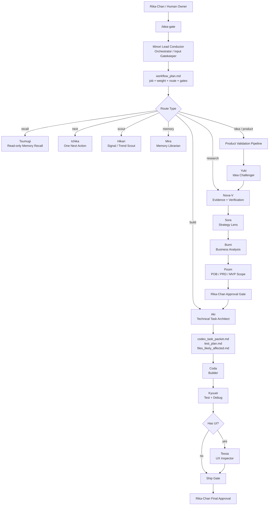
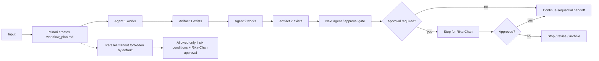
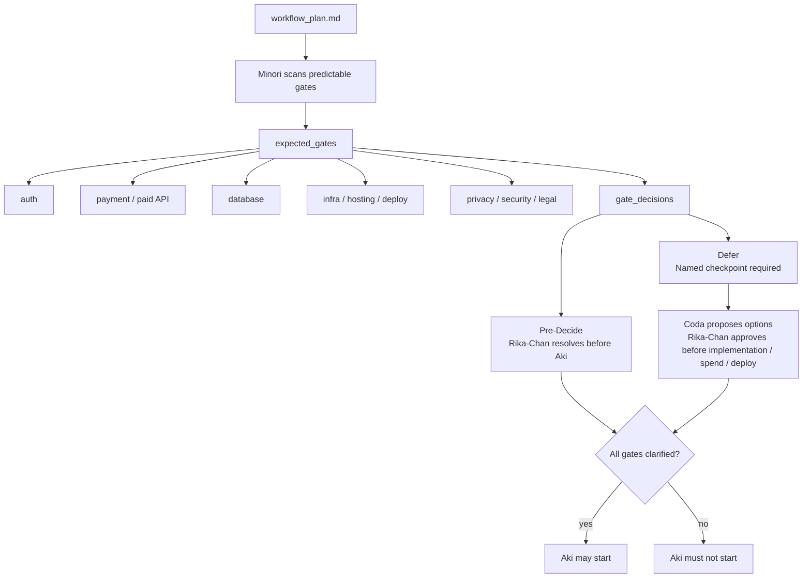
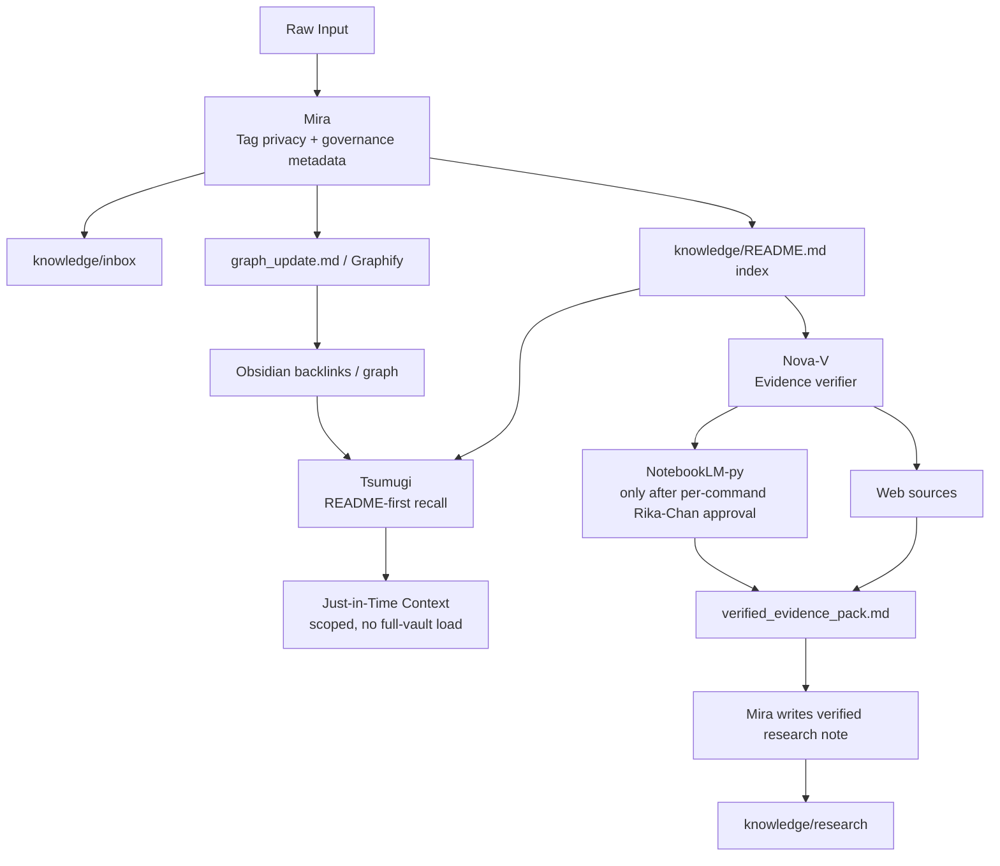
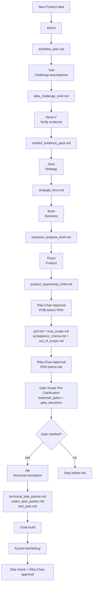
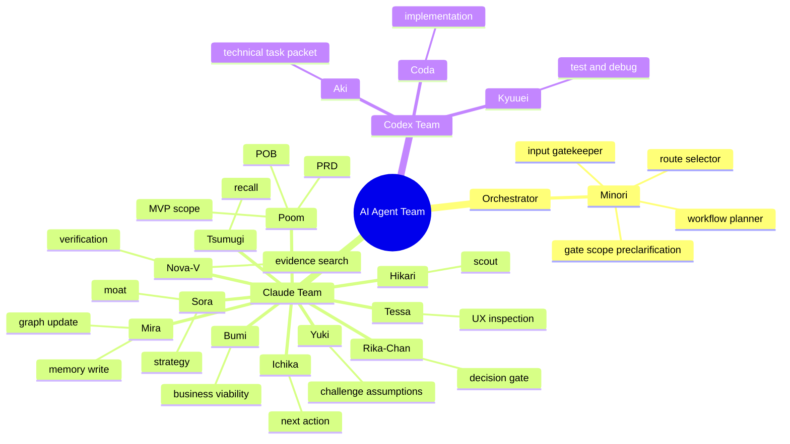

# AI Agent Team Architecture

This system is a **hierarchical multi-agent orchestrator**. Minori is the central router and gatekeeper. Specialized agents execute scoped work through sequential handoff by default. Parallel or dynamic workflow is allowed only after Rika-Chan approval.

## 1. High-Level Orchestrator

## 2. Sequential-By-Default Control Flow

## 3. Gate Scope Pre-Clarification Before Aki

## 4. Memory And Evidence Layer

## 5. Product-To-Build Pipeline

## 6. Agent Team Map

## Canonical References

- `HOW_TO_USE.md` — human-facing usage guide
- `CLAUDE.md` — operating contract
- `AGENTS.md` — root agent instructions
- `workflows/workflow_index.md` — active workflow index
- `workflows/idea_gate.md` — `/idea-gate` schema and routing contract
- `templates/workflow_plan.md` — workflow plan template
